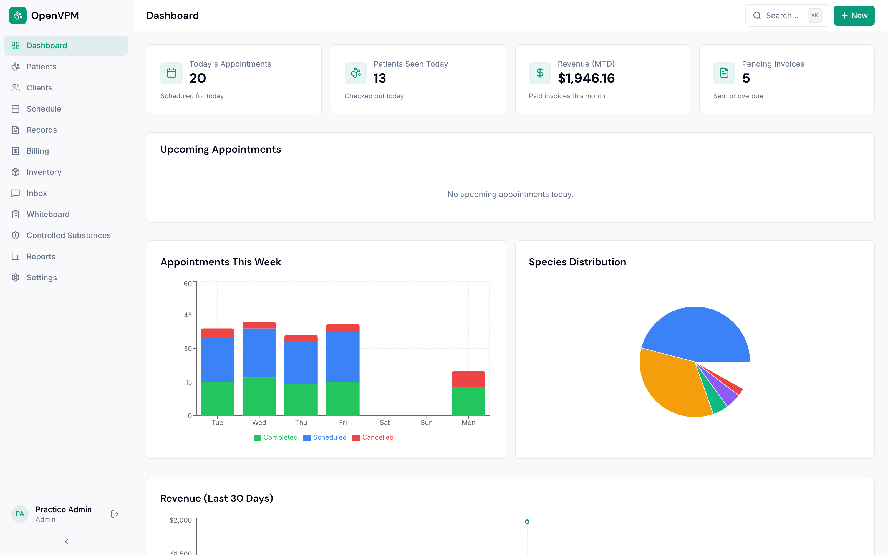
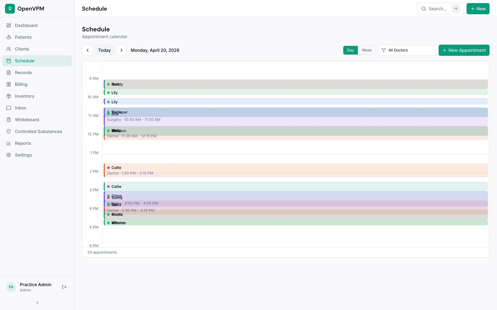
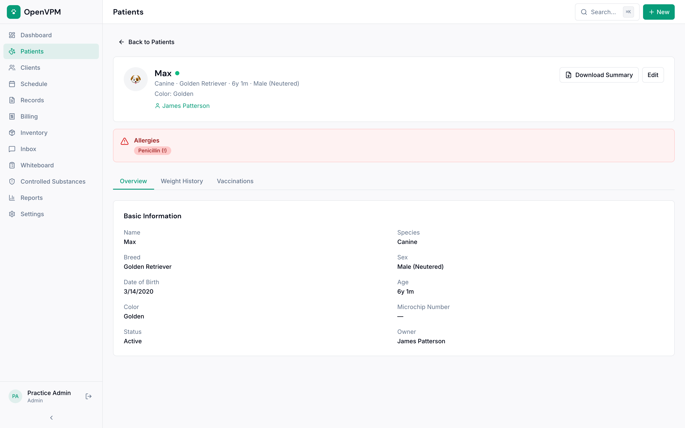

<p align="center">
  
</p>

<h1 align="center">OpenVPM</h1>

<p align="center">
  <strong>The open-source veterinary practice management system the industry has been waiting for.</strong>
</p>

<p align="center">
  <a href="https://openvpm.com">Website</a> &middot;
  <a href="https://openvpm.com/demo">Live Demo</a> &middot;
  <a href="#features">Features</a> &middot;
  <a href="#quick-start">Quick Start</a> &middot;
  <a href="#api">API Docs</a> &middot;
  <a href="#contributing">Contributing</a>
</p>

<p align="center">
  <a href="https://github.com/evangauer/openvpm/actions"></a>
  <a href="LICENSE"></a>
  <a href="https://github.com/evangauer/openvpm/stargazers"></a>
</p>

---

## The Problem

The veterinary PIMS market is broken — and everyone knows it.

**For clinics:** Commercial systems like ezyVet, ProVet Cloud, and Cornerstone charge $200–600+/month, lock you into proprietary data formats, and deliver software that staff describe as "extremely nonuser friendly," "very clunky," with "terrible" financial reporting and support that declines after the sale closes. Legacy systems crash. Modern ones charge extra for texting. Every one of them holds your data hostage.

**For innovators:** Jonathan Ayers (former IDEXX CEO) published research in February 2026 asking whether AI agents will disrupt the PIMS as the "system of record." The answer is yes — but only if there's an open system to build on. Today, most PIMS have closed or poorly documented APIs, making it nearly impossible for AI tools, voice agents, or third-party developers to read and write patient data. There is no widely adopted data interoperability standard in veterinary medicine.

**The open-source gap:** OpenVPMS is Java-based, dated, and primarily Australian-focused. A few student projects exist on GitHub but none are production-ready. Until now, there has been **no modern, well-designed, open-source PIMS with an open API.**

OpenVPM fills that gap.

## What is OpenVPM?

OpenVPM is a modern, cloud-native veterinary practice information management system that is:

- **Beautiful and intuitive** — Practice managers and front desk staff should be productive within a single shift, not a multi-week training program
- **API-first** — Every feature accessible via a documented REST + WebSocket API so AI tools, voice agents, and integrations can read AND write
- **Cloud-native but self-hostable** — Run it on our cloud or deploy it on your own infrastructure
- **Free and open source** — MIT licensed, forever. No per-provider pricing. No vendor lock-in. Your data is yours.

> *"I would need to see the product benefit us by reducing our staff hours."*
> — A practice manager we interviewed during research

That's the bar we're building to.

<!--
## Screenshots

> Screenshots coming soon — see the [live demo](https://openvpm.com/demo) to experience the full application.

| Dashboard | Schedule | Patient Record |
|-----------|----------|----------------|
|  |  |  |
-->

## Features

### Phase 1 — Foundation (Implemented)

**Patient & Client Management**
Complete patient records with species, breed, weight history with trend charts, microchip tracking, photo uploads, and allergy/reaction alerts. Multi-pet households linked to single clients. Instant fuzzy search across all records via Cmd+K.

**Appointment Scheduling**
Visual calendar with day/week views and column-per-doctor layout. Configurable appointment types with durations and colors. Doctor-specific vs. any-doctor scheduling. Full status flow: Scheduled > Checked In > In Exam > Checked Out. Recurring appointments and block scheduling.

**Electronic Medical Records (EMR)**
SOAP notes with rich text editing. Problem lists (active/resolved/chronic). Vaccination records with reminders and certificate generation. Lab results viewer with reference ranges and trend graphs. Prescription management with dosing calculator and refill tracking. Document and image attachments.

**Billing & Invoicing**
Treatment-to-invoice flow where charges auto-populate as services are administered. Itemized invoices with tax calculation. Estimates that convert to invoices. Payment tracking and account balances. End-of-day reconciliation and revenue reporting.

**Inventory Management**
Product catalog with stock levels and reorder point alerts. Lot/batch tracking with expiration dates. Auto-deduction when dispensed from EMR. Purchase order generation. Multi-location support.

**Controlled Substance Tracking**
DEA-compliant controlled substance logging with full audit trails.

### Phase 2 — Communication & Intelligence (Implemented)

**Client Communication Hub**
Unified inbox across calls, texts, emails, and portal messages. SMS/email appointment reminders. Vaccination and wellness reminders. Bulk messaging campaigns. Two-way SMS. Full communication log on every client record.

**Practice Whiteboard**
Real-time patient status board showing patient name, doctor, room, status, time in, procedure, and notes. WebSocket-powered — updates live across all screens.

**Reporting & Analytics**
Dashboard with KPI cards, revenue trends, appointment utilization, species distribution, and production by doctor. Exportable to CSV/PDF.

**Client Portal**
Pet owners can view health records, request appointments, submit prescription refill requests, download vaccination certificates, view invoices, and message the clinic securely.

### Phase 3 — API & AI (Implemented)

**Open API**
Full REST API with OpenAPI/Swagger documentation. Webhook system for real-time events (appointment created, patient checked in, invoice paid). API key management with scopes and rate limiting. Audit logging.

**AI-Ready Architecture**
Structured data models queryable by AI agents. Event stream for agent subscriptions. Integration points for SOAP note generation, triage assistance, differential diagnosis, voice agent booking, and automated form completion.

## Tech Stack

| Layer | Technology |
|-------|-----------|
| **Frontend** | Next.js 14 (App Router), TypeScript, React 18 |
| **UI** | shadcn/ui + Radix UI + Tailwind CSS |
| **API** | tRPC (type-safe) + REST via trpc-openapi |
| **Database** | PostgreSQL 16 + Drizzle ORM |
| **Auth** | NextAuth.js (role-based: Admin, Vet, Technician, Front Desk) |
| **Real-time** | WebSockets for live whiteboard updates |
| **Email/SMS** | Resend + Twilio |
| **Payments** | Stripe |
| **File Storage** | S3-compatible (MinIO for self-hosted) |
| **Monorepo** | Turborepo + pnpm workspaces |
| **Testing** | Vitest + Playwright |
| **Deployment** | Docker Compose (self-host) or Vercel (cloud) |

## Architecture

```
openvpm/
├── apps/
│   ├── web/                    # Next.js frontend + API
│   │   ├── app/                # App Router pages
│   │   │   ├── (auth)/         # Login, register
│   │   │   ├── (dashboard)/    # Main app (12 modules)
│   │   │   ├── (marketing)/    # Landing page
│   │   │   └── portal/         # Client-facing portal
│   │   ├── components/         # UI component library
│   │   ├── lib/                # Utilities and integrations
│   │   └── server/             # 21 tRPC routers
│   └── docs/                   # API documentation
├── packages/
│   ├── db/                     # 16 schema files, seed data
│   ├── api/                    # Shared Zod validators
│   ├── config/                 # TypeScript, Tailwind config
│   └── email/                  # Email templates
├── docker/                     # Docker Compose (PostgreSQL + MinIO)
└── e2e/                        # Playwright E2E tests
```

### Database Design

16 schema files covering every core entity with proper relationships, soft deletes, and multi-tenant isolation via `practice_id`:

`practices` · `locations` · `users` · `clients` · `patients` · `patient_weights` · `patient_allergies` · `appointments` · `appointment_types` · `soap_notes` · `vaccination_records` · `lab_results` · `procedures` · `prescriptions` · `invoices` · `invoice_items` · `products` · `services` · `communications` · `templates` · `controlled_substances` · `webhooks` · `api_keys` · `audit_log`

All clinical data uses typed, relational tables — not JSONB blobs. This means AI agents and integrations can query structured data directly.

### API Coverage

21 tRPC routers exposing 150+ endpoints:

`auth` · `patients` · `clients` · `appointments` · `records` · `billing` · `inventory` · `communications` · `reports` · `dashboard` · `whiteboard` · `portal` · `templates` · `controlled-substances` · `insurance` · `notifications` · `webhooks` · `settings` · `data` · `ai`

Every endpoint includes Zod validation, role-based access control, and is also available as a standard REST endpoint via trpc-openapi.

### Security

- **Multi-tenancy:** Row-level isolation via `practice_id` on every table
- **RBAC:** Four roles (Admin, Veterinarian, Technician, Front Desk) enforced at the API layer
- **Auth:** NextAuth.js with bcrypt password hashing and database sessions
- **Headers:** X-Content-Type-Options, X-Frame-Options, X-XSS-Protection, Referrer-Policy
- **Audit:** Full audit logging of all data changes

## Quick Start

### Prerequisites

- Node.js 20+
- pnpm 9+
- Docker (for PostgreSQL and MinIO)

### Setup

```bash
# Clone the repository
git clone https://github.com/evangauer/openvpm.git
cd openvpm

# Copy environment config
cp .env.example .env

# Start PostgreSQL and MinIO
docker compose -f docker/docker-compose.yml up -d

# Install dependencies
pnpm install

# Apply database schema
pnpm db:push

# Seed with realistic demo data
pnpm db:seed

# Start the development server
pnpm dev
```

Open [http://localhost:3000](http://localhost:3000) and sign in with the demo credentials:

| Role | Email | Password |
|------|-------|----------|
| Admin | admin@neighborhoodvet.example.com | password123 |
| Veterinarian | sarah.chen@neighborhoodvet.example.com | password123 |
| Technician | jamie.torres@neighborhoodvet.example.com | password123 |
| Front Desk | morgan.bailey@neighborhoodvet.example.com | password123 |

The seed data creates a complete demo practice — "Neighborhood Veterinary" — with 8 staff, 25 clients, 40 patients, 2 weeks of appointments, SOAP notes, vaccination records, invoices, and 50 inventory products.

### Deploy with Docker

```bash
docker compose -f docker/docker-compose.yml up -d
```

The Docker setup includes PostgreSQL 16 with health checks, MinIO for S3-compatible file storage, and a multi-stage production build of the web application.

## API

OpenVPM is **API-first**. Every action the UI performs goes through the same API available to third-party integrations. This is the killer feature — no other open-source PIMS has a real, well-documented, read-write API.

### Webhooks

Subscribe to real-time events:

```json
{
  "url": "https://your-app.com/webhook",
  "events": [
    "appointment.created",
    "appointment.checked_in",
    "patient.created",
    "invoice.paid"
  ]
}
```

Payloads are signed with HMAC-SHA256 and delivered with exponential backoff retry.

### API Keys

Scoped API keys with rate limiting and audit logging. Create keys via the Settings panel or the API itself.

### For AI Developers

OpenVPM's structured data models and event streams make it the ideal foundation for veterinary AI:

- **Voice agents** can book appointments, process refill requests, and complete forms via the API
- **AI scribes** can write SOAP notes directly into the medical record
- **Diagnostic AI** can read lab results, patient history, and write assessment suggestions
- **Reminder systems** can query overdue vaccinations, pending follow-ups, and automate outreach

The PIMS is the system of record. AI agents are first-class citizens.

## Why Open Source Matters for Veterinary Medicine

The veterinary industry is at a crossroads. AI is arriving. Data interoperability is becoming critical. And the dominant PIMS vendors are still charging hundreds per month for software that crashes, frustrates staff, and locks clinics into proprietary ecosystems.

Open source changes the equation:

- **Clinics own their data.** Export everything, any time. No lock-in, period.
- **The community drives the roadmap.** Features are built because practices need them, not because a sales team prioritized them.
- **AI builders can innovate.** An open API and structured data models mean the next generation of veterinary AI tools can be built on a foundation that actually works.
- **Costs go to zero.** The software is free. Forever. Invest the $200–600/month you were paying into your team instead.

We believe the best software for veterinary medicine should be built *with* the veterinary community, not sold *to* it.

## Contributing

We welcome contributions from developers, veterinary professionals, and anyone who believes in open-source healthcare software.

See [CONTRIBUTING.md](CONTRIBUTING.md) for development setup, coding standards, and how to submit pull requests.

### Areas Where We Need Help

- **Veterinary domain expertise** — Help us get the clinical workflows right
- **UI/UX design** — Help us make every screen intuitive
- **Integrations** — Lab equipment (IDEXX, Abaxis), payment processors, telemedicine
- **Internationalization** — Help us support practices worldwide
- **Testing** — E2E tests, integration tests, accessibility audits
- **Documentation** — API guides, deployment tutorials, user manuals

## Roadmap

- [x] Patient & client management
- [x] Appointment scheduling with calendar views
- [x] Electronic medical records (SOAP, labs, vaccinations, prescriptions)
- [x] Billing & invoicing
- [x] Inventory management with reorder alerts
- [x] Controlled substance tracking
- [x] Client communication hub (email, SMS, portal)
- [x] Real-time practice whiteboard
- [x] Reporting & analytics dashboard
- [x] Client portal
- [x] Open API with webhooks
- [x] AI integration points
- [ ] Online booking widget (embeddable)
- [ ] FHIR-inspired veterinary data standard
- [ ] Multi-language support
- [ ] Mobile companion app
- [ ] Telemedicine integration
- [ ] Advanced AI features (auto-coding, predictive analytics)

## Community

- **Website:** [openvpm.com](https://openvpm.com)
- **GitHub Discussions:** [Join the conversation](https://github.com/evangauer/openvpm/discussions)
- **Email:** hello@openvpm.com

## License

MIT License — see [LICENSE](LICENSE) for details.

Free to use, modify, and distribute. Build on it. Sell services around it. Make veterinary medicine better.

---

<p align="center">
  <strong>Built for the veterinary community, by people who believe great software should be accessible to every practice.</strong>
</p>
